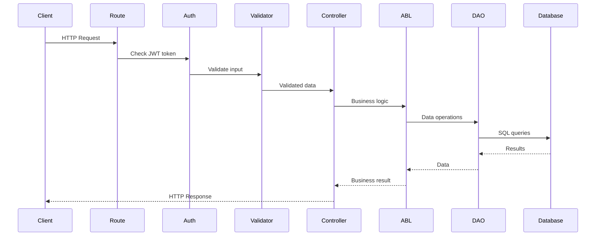
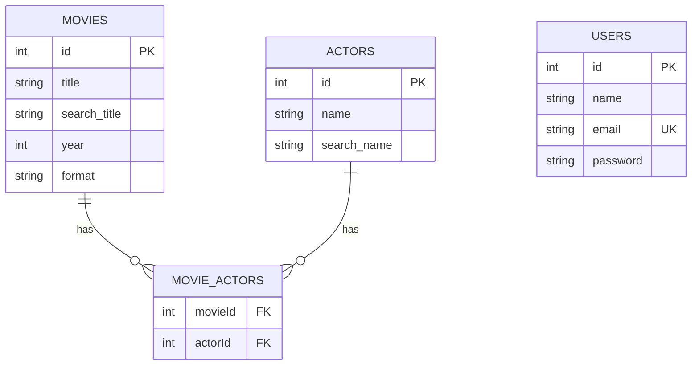
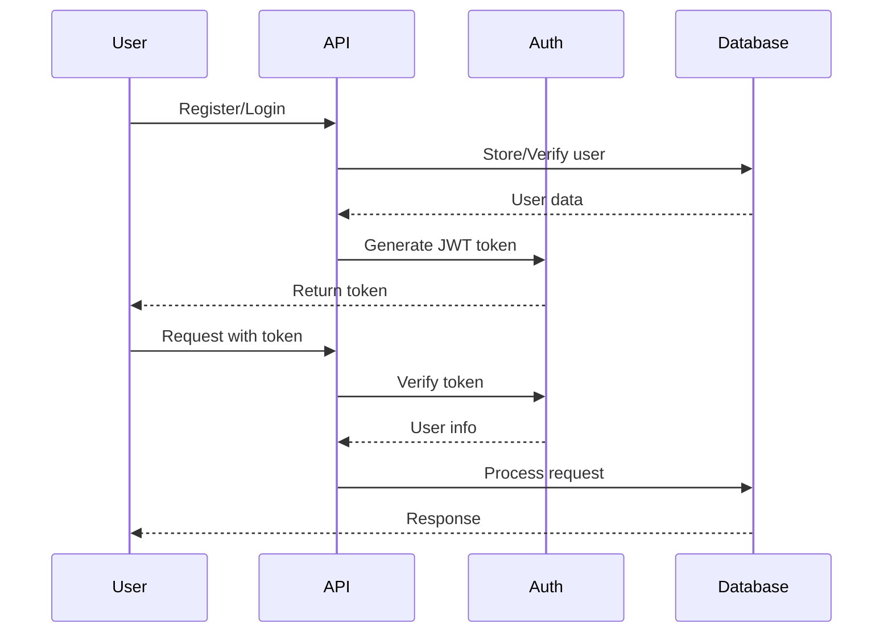

# Architecture Documentation

This document provides an overview of the Express Movies API architecture and instructions for running the application.

---

## Architecture Overview

The application follows a **layered architecture** with clear separation of concerns using the **ABL/DAO/Controller pattern**.

### Architecture Layers

```
┌─────────────────────────────────────┐
│         HTTP Request                │
└──────────────┬──────────────────────┘
               │
               ▼
┌─────────────────────────────────────┐
│         Controller Layer            │  ← HTTP handling
│    (app/api/controllers/)            │
└──────────────┬──────────────────────┘
               │
               ▼
┌─────────────────────────────────────┐
│         ABL Layer                   │  ← Business logic
│    (app/abl/)                        │
└──────────────┬──────────────────────┘
               │
               ▼
┌─────────────────────────────────────┐
│         DAO Layer                   │  ← Data access
│    (app/dao/)                       │
└──────────────┬──────────────────────┘
               │
               ▼
┌─────────────────────────────────────┐
│         Database (SQLite)           │
└─────────────────────────────────────┘
```

### Key Principles

- **Separation of Concerns**: Each layer has a specific responsibility
- **Dependency Injection**: Dependencies are injected for testability
- **Single Responsibility**: Each component has one clear purpose
- **Error Handling**: Centralized error handling

---

## Request Flow

### Complete Request Lifecycle



### Example: Creating a Movie

```
1. POST /api/v1/movies
   ↓
2. Authentication middleware verifies JWT
   ↓
3. Validation middleware checks request data
   ↓
4. Controller extracts validated data
   ↓
5. ABL executes business logic
   ↓
6. DAO performs database operations (with transaction)
   ↓
7. Response flows back through layers
   ↓
8. JSON response sent to client
```

---

## Project Structure

```
express-movies/
├── app/
│   ├── abl/              # Business Logic Layer
│   │   ├── movie/        # Movie operations
│   │   ├── session/      # Authentication
│   │   └── user/         # User management
│   │
│   ├── api/
│   │   ├── controllers/   # HTTP handlers
│   │   ├── errors/        # Error classes
│   │   ├── routes/        # Route definitions
│   │   └── validation-schemas/  # Input validation
│   │
│   ├── components/
│   │   ├── dto/          # Data transformation
│   │   ├── helpers/      # Utilities
│   │   └── services/     # JWT, password hashing
│   │
│   ├── dao/              # Data Access Layer
│   ├── middleware/       # Express middleware
│   └── models/          # Database models
│
├── test/                # Test files
├── index.js            # Application entry point
└── package.json
```

---

## Component Responsibilities

### Controller Layer

- **Purpose**: Handle HTTP requests and responses
- **Location**: `app/api/controllers/`
- **Responsibilities**:
    - Extract data from requests
    - Call ABL methods
    - Set HTTP status codes
    - Return JSON responses

### ABL Layer (Application Business Logic)

- **Purpose**: Implement business rules
- **Location**: `app/abl/`
- **Responsibilities**:
    - Business validation
    - Orchestrate operations
    - Coordinate services
    - Throw domain errors

### DAO Layer (Data Access Object)

- **Purpose**: Database operations
- **Location**: `app/dao/`
- **Responsibilities**:
    - Execute database queries
    - Manage transactions
    - Handle associations
    - Return plain objects

### Middleware

- **Authentication**: Verifies JWT tokens
- **Validation**: Validates request data
- **Error Handler**: Centralized error processing

---

## Database Schema

### Entity Relationship



### Tables

**users**

- Stores user accounts with hashed passwords

**movies**

- Stores movie information (title, year, format)

**actors**

- Stores actor names

**movie_actors**

- Junction table for many-to-many relationship
- CASCADE DELETE on movie deletion

### Indexes

- `idx_movies_title` - for title searches
- `idx_movies_search_title` - for case-insensitive title search (normalized field)
- `idx_movies_year` - for year sorting
- `idx_movies_title_year_format` - helps duplicate checks (title + year + format)
- `idx_actors_name` - for actor searches
- `idx_actors_search_name` - for case-insensitive actor search (normalized field)
- `idx_users_email` - unique index for email lookups

---

## Security Architecture

### Authentication Flow



### Security Features

- **Password Hashing**: bcrypt with configurable rounds
- **JWT Tokens**: Signed tokens with expiration (**45 minutes**)
- **Input Validation**: All inputs validated
- **SQL Injection Protection**: ORM with parameterized queries

### Startup Safety

- **Environment validation**: app fails fast if `JWT_SECRET` is missing or empty.
- **404 handling**: unknown routes return a standardized `notFound` error response.

---

## Error Handling

### Error Flow

```
Error occurs in ABL/DAO
    ↓
Error propagates through layers
    ↓
Caught by error handler middleware
    ↓
Error normalized (status code, message)
    ↓
Logged (if server error)
    ↓
JSON response sent to client
```

### Error Response Format

```json
{
  "error": "errorCode",
  "message": "Human-readable message",
  "paramMap": {
    "additional": "error details"
  }
}
```

---

## Running the Application

### Prerequisites

- Node.js 20 or higher
- npm or yarn

### Local Development

#### 1. Clone Repository

```bash
git clone git@github.com:starlingProj/express-movies.git
cd express-movies
```

#### 2. Install Dependencies

```bash
npm install
```

#### 3. Configure Environment

Create `.env` file in root directory:

```env
# Required
JWT_SECRET=your-secret-key-here-minimum-32-characters

# Optional
APP_PORT=3000
PASSWORD_SALT_ROUNDS=10
DB_STORAGE=./app/config/dev.sqlite
DB_LOGGING=false
NODE_ENV=development
```

**Important:** `JWT_SECRET` must be at least 32 characters.

#### 4. Start Development Server

```bash
npm run dev
```

**Expected Output:**

```
Database Connected
App is running on port 3000
```

#### 5. Verify Installation

```bash
curl http://localhost:3000/api/v1/movies
```

### Production

```bash
npm start
```

### Docker

#### Quick Start

```bash
# Pull image
docker pull vovashpak/express-movies:latest

# Run container
docker run -d \
  --name express-movies \
  -p 8000:8050 \
  -e JWT_SECRET=your-secret-key-minimum-32-characters \
  vovashpak/express-movies:latest
```

#### Verify

```bash
docker logs express-movies
curl http://localhost:8000/api/v1/movies
```

### Running Tests

```bash
npm test
```

---

## API Endpoints

### Base URL

- **Local**: `http://localhost:3000/api/v1`
- **Docker**: `http://localhost:8000/api/v1`

### Authentication

Include JWT token in `Authorization` header:

```
Authorization: Bearer <your-jwt-token>
```

### Main Endpoints

- `POST /users` - Create user (returns token)
- `POST /sessions` - Login (returns token)
- `GET /movies` - List movies (requires auth)
- `GET /movies/:id` - Get movie (requires auth)
- `POST /movies` - Create movie (requires auth)
- `PATCH /movies/:id` - Update movie (requires auth)
- `DELETE /movies/:id` - Delete movie (requires auth)
- `POST /movies/import` - Import movies from file (requires auth)

---

## Key Features

### Transaction Management

Critical operations use database transactions:

- Movie creation (movie + actors)
- Movie update (movie + actors)
- Bulk import (multiple movies)

### Duplicate Handling

- **Create movie**: ABL checks duplicates by `title + year + format` and compares the **set of actors**. If the same movie exists, returns `movieAlreadyExists` (409).
- **Import movies**: DAO filters duplicates during bulk creation and returns `skipped` count; Import ABL exposes it as `meta.duplicates`.

### International Search & Sorting (Ukrainian-friendly)

- **Search**: SQLite `LOWER()` is not reliable for Ukrainian/non-ASCII. The app stores normalized fields:
    - `movies.search_title` (from `title.toLowerCase()`)
    - `actors.search_name` (from `name.toLowerCase()`)
      and searches against those fields (indexed).
- **Sorting**: Title sorting uses `Intl.Collator("und", ...)` for locale-aware ordering across languages, including Ukrainian characters.

### Dependency Injection

Factory functions allow injecting dependencies for testing:

### Data Validation

- Input validation at API boundary
- Business rule validation in ABL
- Database constraints in models

---

## Summary

The Express Movies API uses a clean, layered architecture that separates:

- **HTTP handling** (Controllers)
- **Business logic** (ABL)
- **Data access** (DAO)

This structure provides:

- Clear separation of concerns
- Easy testing with dependency injection
- Maintainable and scalable code
- Secure authentication and validation
